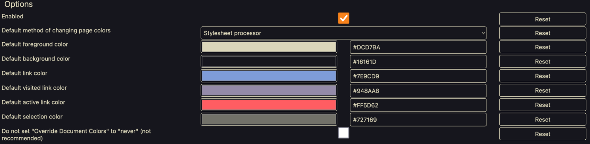

# darkbackgroundlighttext-kanagawa

Below are configuration settings to create a Kanagawa theme for the Firefox extension [Dark Background and Light Text.](https://addons.mozilla.org/en-US/firefox/addon/dark-background-light-text/)

The theme is based on [rebelot's Kanagawa Neovim theme.](https://github.com/rebelot/kanagawa.nvim)

| Setting      | Value  |
|--------------|--------|
| Foreground   | DCD7BA |
| Background   | 16161D |
| Default link | 7E9CD9 |
| Visited link | 948AA8 |
| Active link  | 948AA8 |
| Selection    | 727169 |

